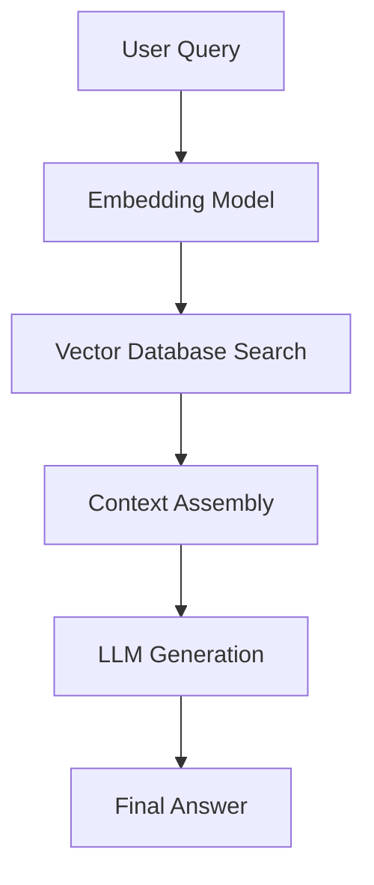

# Retrieval-Augmented Generation (RAG)

Retrieval-Augmented Generation (RAG) optimizes LLM outputs by querying authoritative external knowledge sources before generating responses.

## Core Architecture

## Step-by-Step Process

1.  **Ingestion:**
    *   **Document Loading:** Parsers for PDF, HTML, TXT, DOCX, etc.
    *   **Chunking:** Splitting text into manageable pieces (e.g., character-based, token-based, recursive chunking).
    *   **Embedding:** Transforming text chunks into vector representations (using models like OpenAI `text-embedding-3`, Cohere, or Hugging Face models).
    *   **Indexing:** Storing vector representations in a database.
2.  **Retrieval:**
    *   The user query is embedded.
    *   A vector similarity search (usually Cosine Similarity or Dot Product) finds the top-$k$ nearest neighbors in the Vector DB.
3.  **Generation:**
    *   The retrieved chunks are formatted as prompt context.
    *   The LLM generates a response constrained by the retrieved data.

## Vector Databases
*   **Pinecone:** Managed, highly scalable.
*   **Chroma / FAISS:** Open-source, local/in-memory, great for prototyping.
*   **pgvector:** Extension for PostgreSQL, ideal for SQL-integrated apps.
*   **Milvus / Qdrant:** Enterprise-grade open-source vector databases.

## Advanced RAG Techniques
*   **Hybrid Search:** Combining vector similarity (semantic) search with keyword-based (BM25) search.
*   **Reranking:** Passing retrieved chunks through a cross-encoder model to re-evaluate their relevance score before feeding them to the LLM.
*   **Query Expansion/Rewriting:** Using an LLM to rephrase or generate multiple search queries from the user input.
